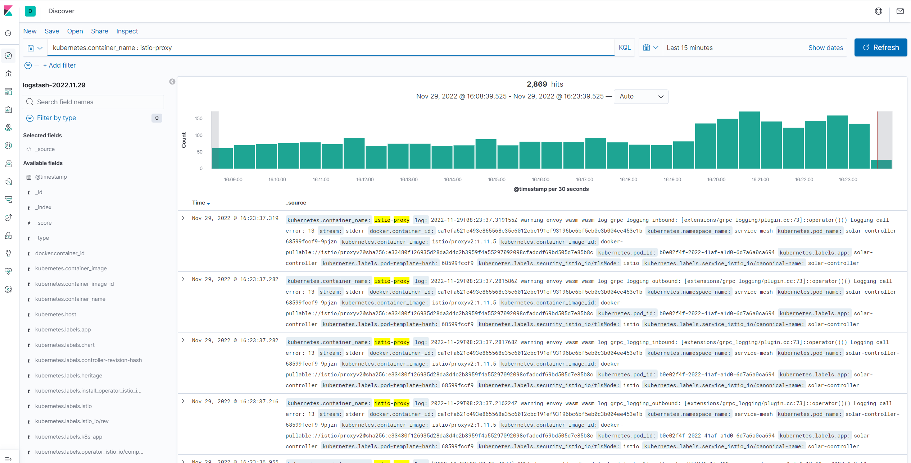

# kubernetes-efk

## install

```shell
kubectl apply -f .
```

When the instance of es is ready, remember to execute:

```shell
kubectl rollout restart ds -n logging
```

```shell

$ kubectl get po -n logging
NAME                             READY   STATUS    RESTARTS   AGE
elasticsearch-598c9495c5-hfbvl   1/1     Running   0          11m
fluentd-d827f                    1/1     Running   0          109s
fluentd-fq2bn                    1/1     Running   0          90s
kibana-58796c569d-tlxz4          1/1     Running   0          11m

$ kubectl logs -f -n logging fluentd-4zfxt 
2022-11-29 08:19:58 +0000 [info]: #0 [in_tail_container_logs] following tail of /var/log/containers/networking-agent-d84b68fd-jcl5m_service-mesh_networking-agent-fb05dc126525db5d8f839b00cb1c50f310a13c035ac408d039b2d5e17cad70f4.log
2022-11-29 08:19:58 +0000 [info]: #0 [in_tail_container_logs] following tail of /var/log/containers/reviews-v2-568fdb8b4c-lz6sw_bookinfo_istio-proxy-3987cf23664fd539822fc91fd903d2cd184673bc60fb75a9f78f56a4503a7acf.log
2022-11-29 08:19:58 +0000 [info]: #0 [in_tail_container_logs] following tail of /var/log/containers/solar-controller-68599fccf9-88842_service-mesh_istio-proxy-6d3b65d2f3220a0fa761f4ae7fb17107b04ddf6b8e66beea69ffc63fdb95e0a2.log
2022-11-29 08:19:59 +0000 [info]: #0 [in_tail_container_logs] following tail of /var/log/containers/networking-agent-d84b68fd-jcl5m_service-mesh_grpc-logging-e286286b8a881bc1242784f1d114d6acdfb5d48493c3f9b0889f5ac529707bf9.log
2022-11-29 08:19:59 +0000 [info]: #0 [in_tail_container_logs] following tail of /var/log/containers/networking-agent-d84b68fd-jcl5m_service-mesh_istio-proxy-6c12a469d24171bd2ca332dca51948208c2ce3e8cb466c1bba6fd63dfebe49f4.log
2022-11-29 08:19:59 +0000 [info]: #0 [in_tail_container_logs] following tail of /var/log/containers/networking-agent-d84b68fd-jcl5m_service-mesh_networking-agent-1679eef26da0d9c2086250b0682695a81cd2f69942fc3be4d8239b6217f8f1bf.log
2022-11-29 08:19:59 +0000 [info]: #0 fluentd worker is now running worker=0
...
```

Ok, Now you can access kibana: http://nodeIp:30000




## Uninstall

```shell
kubectl delete -f . 
```

